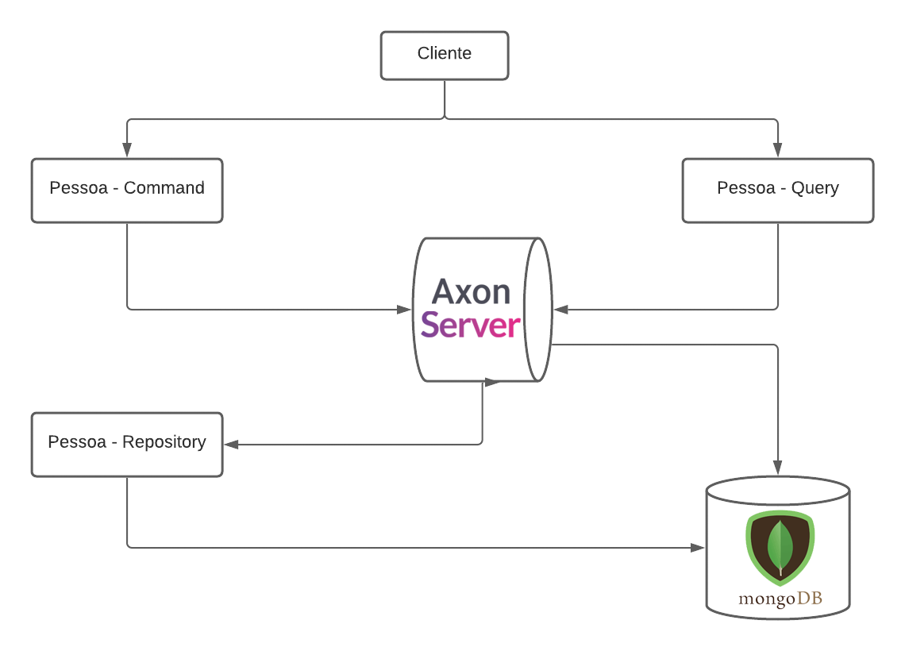

# Microsservços Manter Pessoa com DDD, Arquitetura de Microsserviços, CQRS e event sourcing.

#### Esta aplicação foi desenvolvida especificamente para fins didáticos  e por isso, não leva em conta aspectos como segurança.

### Objetivo:
- exemplificar uma aplicação escalável, usando conceitos: DDD, Arquitetura de Microsserviços,   CQRS e event sourcing, para tanto, está solução exemplo é responsável pelo domínio de cadastro de pessoa e é composta por três microsserviços, sendo eles: 

### Serviços: 
- 1 – Pessoa - Command:  responsável pelo recebimento de comandos relacionado a alteração e ou inclusão de 
- dados no banco e gera os eventos relacionados para os respectivos serviços que faz a alteração, no nosso exemplo será o serviço “pessoa - repository”.
- 2 – Pessoa – Repository: Responsável por receber os eventos de atualização do banco de dados e processa-los. 
- 3 – Pessoa – Query: Responsável por receber o processar as solicitações de consulta no banco de dados. 
 
A integração entre os serviços será feita pelo Axon Server, sendo assim temos o seguinte Fluxograma: 

- No fluxograma acima vemos os três microsserviços em funcionamento, o command recebe as solicitações de alteração/inclusão de dados e gera um evento no Axon para esta alteração/inclusão, por sua vez o serviço de repository recebe este evento do Axon e processa a solicitação. O serviço de query atente as solicitações de consulta do banco e o mesmo é ligando ao Axon, somente para atualizar a query em caso de um evento ser processado durante a pesquisa. 

### Pré-requisitos
* JDK 16
* Docker

## Executando o projeto

Ates de tudo é preciso baixar a branch da aplicação execute a instrução abaixo: 
`git clone https://github.com/infortic/microservicos-pessoa-cqrs-eventSourcing-ddd-mongodb.git`

- 1- Primeiramente é preciso subir o servidor do Axon e o banco de dados neste exemplo é o Mongodb.
- 2- Execute `docker-compose up` no diretório raiz do projeto para subir tanto o Axon como o Banco de Dados.
- 3- Na pasta principal de cada serviço execute `mvnw clean install` para compilar cada proojeto.
- 4- após o passo '3' será criado dentro da raiz de cada serviço uma pasta chamada 'target', dentro dela está o serviço compilado, dentro da pasta 'target' de cada serviço execute: `java -jar` e o nome do '.jar' que foi gerando dentro da pasta. 
- 5- se tudo correu bem você conseguira acessar o serviço de command neste link: http://localhost:1001/swagger-ui.html e o Serviço de Query no link: http://localhost:1002/swagger-ui.html

